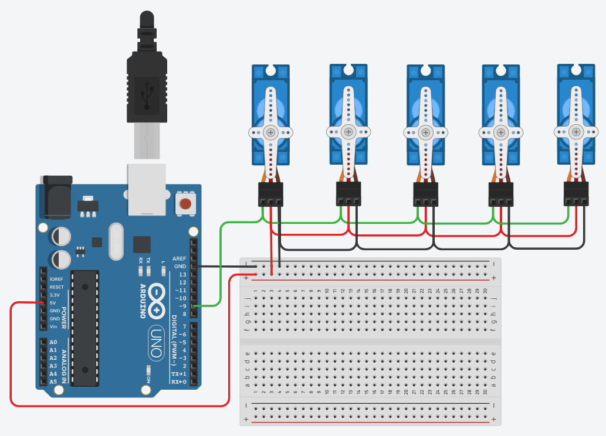
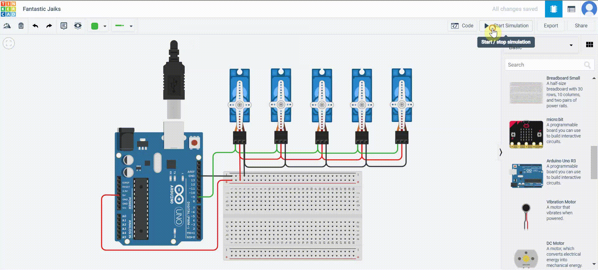

# arduino_robot_arm
This project aimes to design electronic circuite to control 5 servo motors.

## Steps:
  ### Installation:
    Firstly we need to use three componants (Arduino Uno R3, Micro Sevo, Breadboard) 
    1. Plug *ground(GND)* wire in the arduino into the negative port in the breadboard.
    2. Plug ground wire in the micro servo into the negative port in the breadboard.
    3. Plug power wire in the micro servo into the 5 volt(5V) in the arduino.
    4. Plug signal wire in the micro servo into the -9 port in the arduino.

## Requirements:
  - Tinkercad

## Result

## Demo

